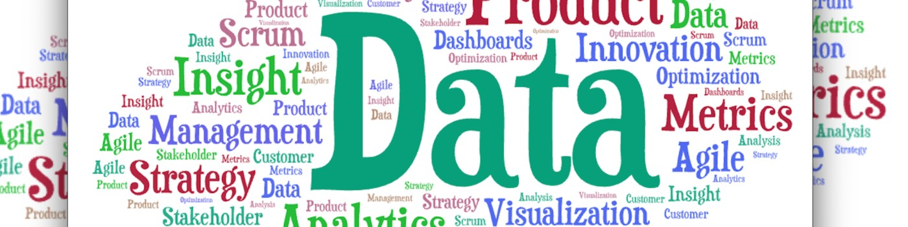

# 👋🏽 Introduction 

### Hello, I'm Tiffany! Part data detective, part dashboard artist, part process improvement magician, full-on efficiency machine. I don’t just report numbers — I spin them into actionable **GOLD!**

### 🔍 Projects 

1. Semiconductor Industry: AI Computation & Hardware Trends       
Focus: Market mapping, R&D trends, competitive benchmarking.  
Tools: SQL, Tableau  
[View Project →](./semiconductor-ai-computing/README.md)  Being Uploaded Currently
2. Mobility: Autonomous Vehicle Startup Trends   
Focus: Funding trends, company mapping, tech stack analysis.  
Tools: Google Sheets, Jupyter Notebook   
[View Project →](./mobility-autonomous-vehicles/README.md)  Being Uploaded Currently
3. Pharma: GLP-1 Receptor Agonist Market   
Focus: Market size, efficacy comparisons, FDA approval timelines.  
Tools: SQL, Tableau  
[View Project →](./pharma-glp1-analysis/README.md)   Being Uploaded Currently

### 🧠 Skills Demonstrated 
- Data wrangling & transformation (SQL, Google Sheets, Jupyter Notebook)
- Visual storytelling (Tableau, Google Sheets)
- Operations planning & stakeholder-focused reporting
- Market intelligence & trend analysis

### 🛠️ Tools
Tableau | Google Sheets | MySQL | Agile | Pandas | Jupyter Notebook 

### 📱 Connect with me
- [LinkedIn](www.linkedin.com/in/tiffanyharris08)
- [Tableau](https://public.tableau.com/app/profile/tiffany.harris8591/vizzes)

